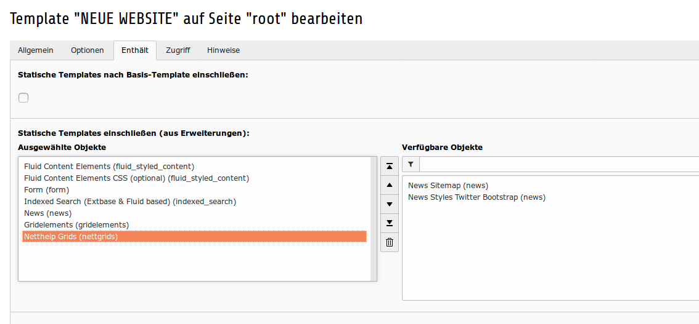
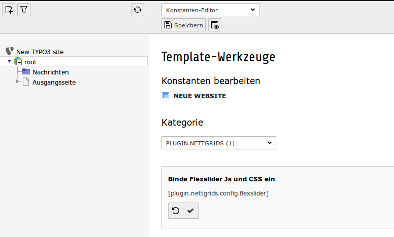

.. ==================================================
.. FOR YOUR INFORMATION
.. --------------------------------------------------
.. -*- coding: utf-8 -*- with BOM.

.. include:: ../Includes.txt

.. _admin-manual:

Administrator Manual
====================

.. _admin-installation:

Installation
------------

To install the extension, perform the following steps:
- Install the extension nettgrids. 
- You have installed gridelemets with version >= 8.0.0
- Bootstrap is needed for some of the elements
- Include the static template file after the gridelements template file

Zur Installation der Extension sind folgende Schritte notwendig:
- Installation der Extension nettgrids
- Es muss vorher gridelemets in der Version >= 8.0.0 installiert sein
- Bootstrap ist notwendig für einige der Elemente
- Das statische Template muss nach dem Template von gridelements eingebunden sein

.. _admin-configuration:

Configuration
-------------

* You can prevent the loading of JavaScript and CSS files via the constants editor.

* Sie können das Laden der JavaScript und CSS Dateien verhindern über den Konstanten-Editor.

