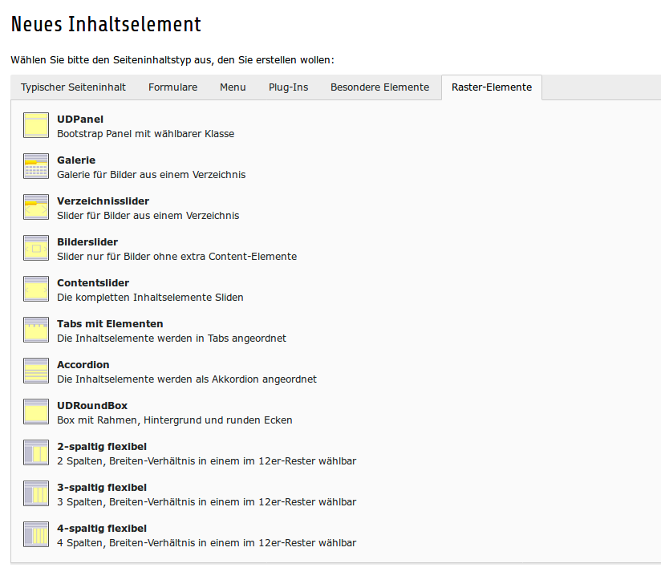

.. ==================================================
.. FOR YOUR INFORMATION
.. --------------------------------------------------
.. -*- coding: utf-8 -*- with BOM.

.. include:: ../Includes.txt

.. _introduction:

Introduction
============

This is my first pubished extension. It is needed for my student company
https://netthelp.de. We use a kind of construction kit for building web
sites with Typo3. This extension is part of the construction kit.

Dies ist meine erste veröffentlichte Extension. Ich nutze sie für meine
Schülerfirma htt://netthelp.de. Wir benutzen eine Art Bauskasten um
Webseiten mit Typo3 bequem erstellen zu können.

.. _what-it-does:

What does it do?
----------------

Nettgrids provides sond gridelements based on bootstrap.

Netgrids liefert einige Gridelemente, die auf bootstrap basieren.

.. _screenshots:

Screenshots
-----------

The following screenshot shows the gridelement available in this extension.

Der folgende Screenshot zwigt die in der Extension verfügbaren Elemente.

   Screenshot from 'New Content Element' in the Backend

   There are 11 different Content elements available from the Backend
